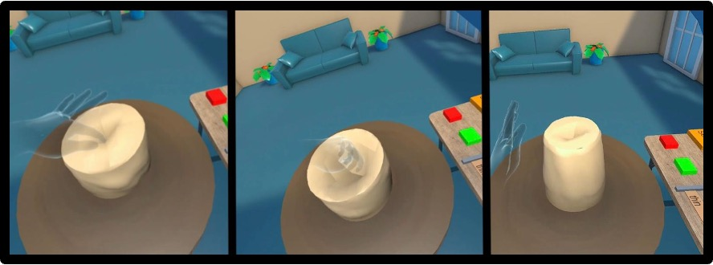
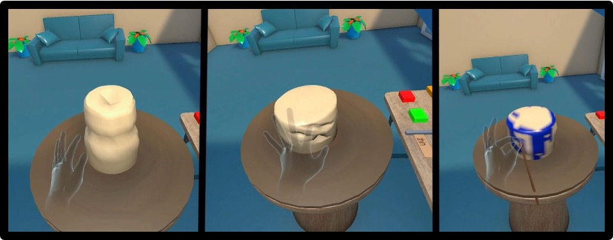
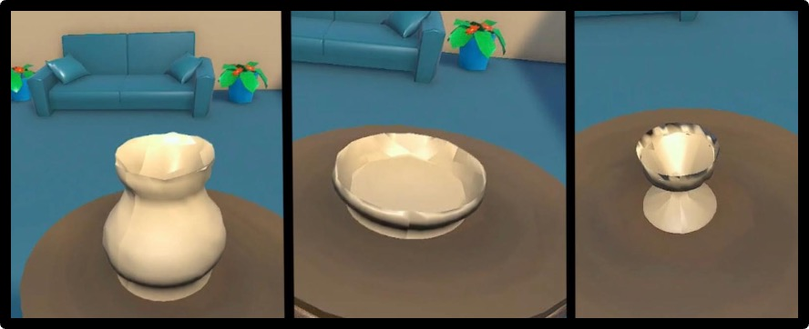
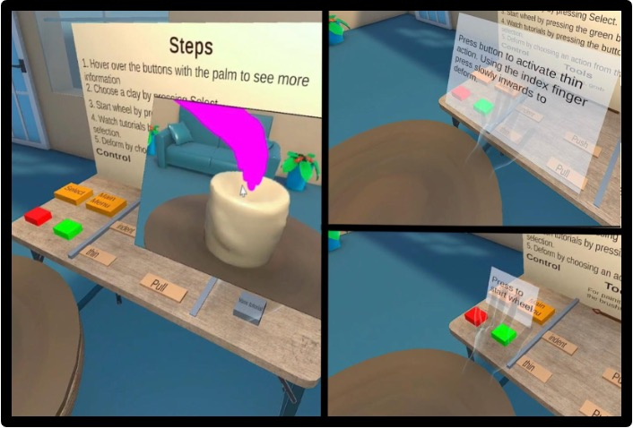
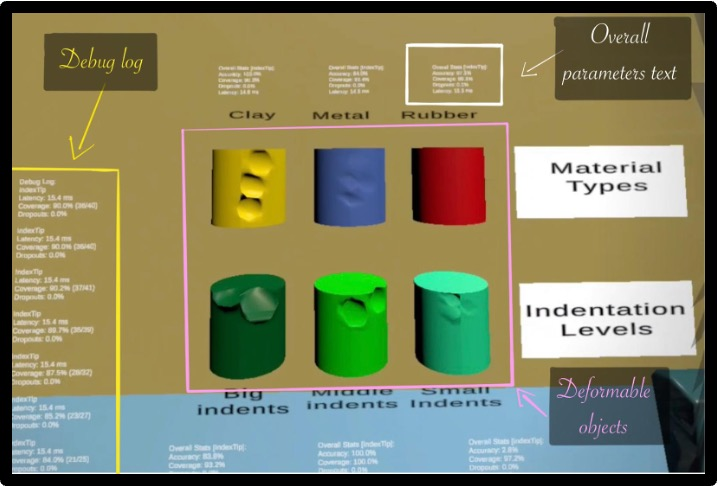

# LeapCraftVR — VR Pottery Training Simulator 

**LeapCraftVR** is a Unity **PCVR** pottery simulation designed for **training-oriented clay modelling** using **real-time 3D mesh deformation** and **hand-tracking technology**. The project uses the Leap Motion Controller mounted for VR use and was tested with **Meta Quest 3**.

## Demo
- Pottery game demo video: **<https://youtu.be/Y8tuj2MCTgI>**

## Highlights
- **Real-time clay deformation** inspired by real pottery techniques:
  - **Chain-based pull-up** deformation (raise the clay while thinning the affected area)
  - **Push-down / opening** deformation (flattening and creating openings)
  - **Thinning** deformation for vase-like shapes (stronger inner-zone shaping + smoother transition)
  - **Pressure-based indentation** (force-dependent indent area + falloff)
  - **brush painting**
    
  ### Pull & Push
  
  
  ### Thin, Indent & Paint
  
  
- **Mass/volume preservation + refinement**
  - Volume is recomputed and preserved across deformation steps, with synchronization between modes.
  - Smoothing refinements (e.g., Laplacian smoothing) are used to reduce artifacts.

  ### Object Creation Capabilities
  
  
- **Training UI and usability**
  - Floating menus for starting/resetting/exiting and clay selection.
  - Hover-based guidance: placing the palm near controls shows contextual instructions.
  - Tutorial video buttons (e.g., vase/cup/bowl shaping guidance).
  - Button press animation + sound feedback.

  ### Training Mechanism
  
  
- **Comparison game**
  - A secondary scene designed to collect performance parameters (latency, accuracy-like parameters) for comparing hand-tracking setups (Leap vs Meta).

  ### Comparison Game Scene Setup
  

## Technologies Used
- Unity 6 (Version: **6 (6000.1.x)**.)
- C#
- Blender
- Shader Graph

## Target Platform
- PCVR application for Windows
- Tested with Meta Quest 3 and Leap Motion Controller
- Dedicated GPU recommended

> The project can be explored in Unity without VR hardware, but the intended experience and hand-tracking features require the devices listed above.
